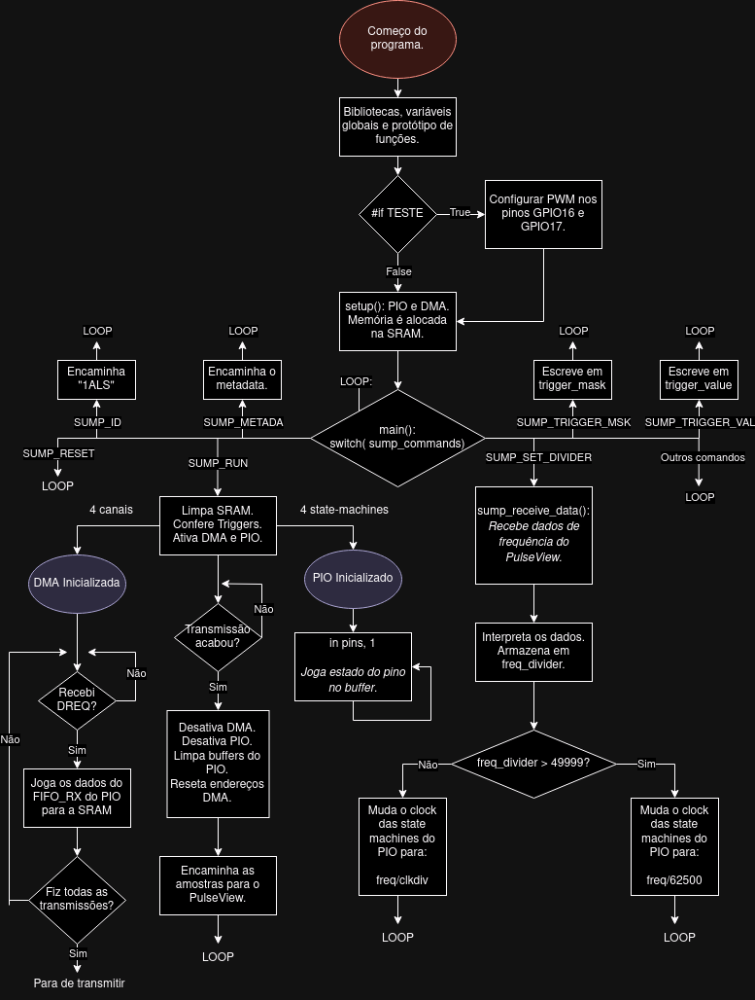
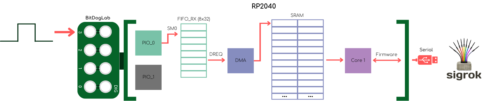
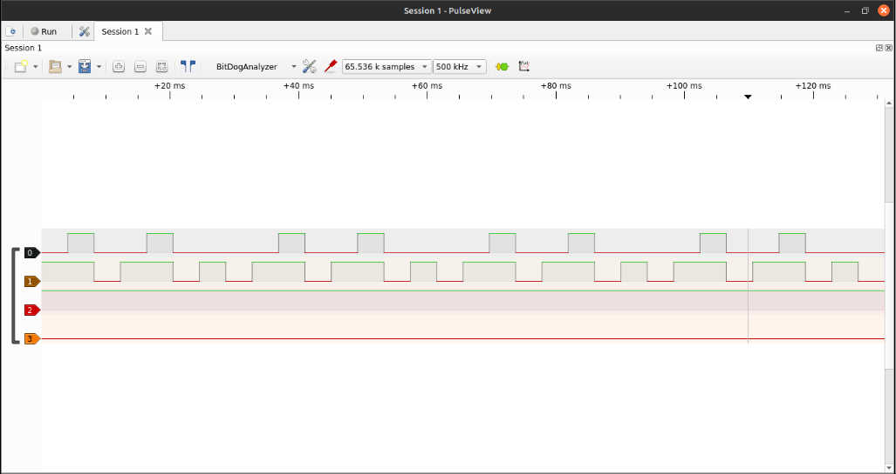
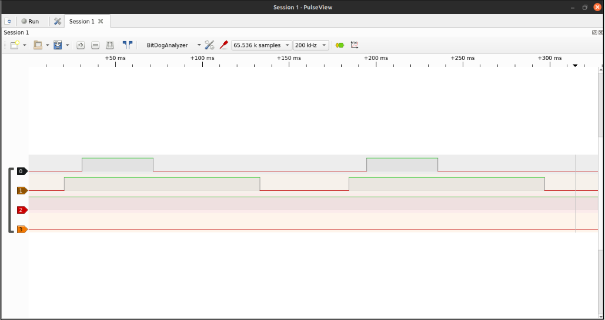
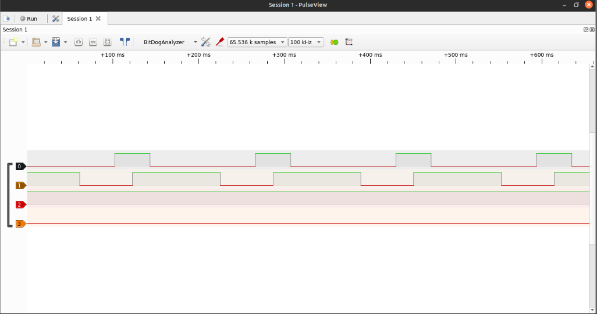
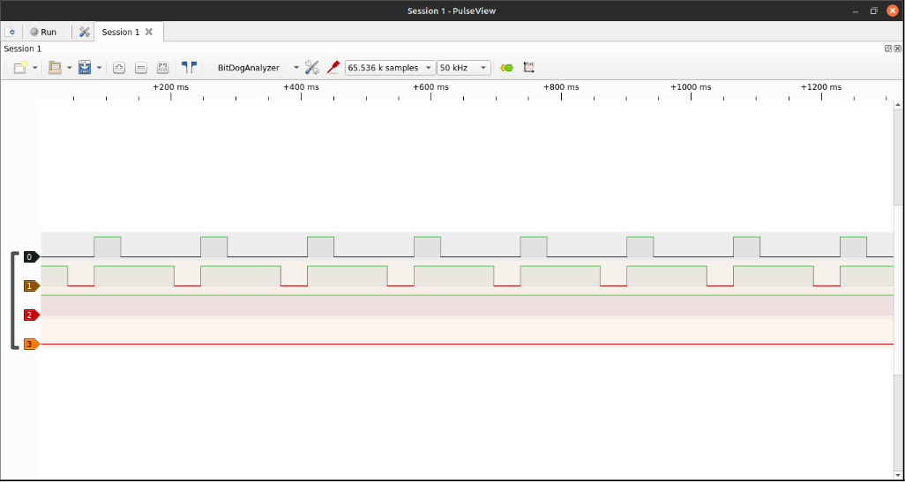
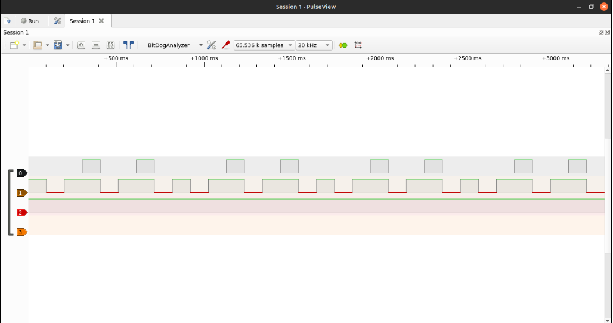

# Fase 1 - Projeto Final: BitDogAnalyzer

> **(!)** Esta seção do repositório ainda está sob desenvolvimento.

O **BitDogAnalyzer** consiste numa prova de conceito (PoC) de um analisador lógico de quatro terminais implementado no BitDogLab V6.3. O analisador lógico se comunica mediante o protocolo SUMP com o software de análise de sinais Sigrok, permitindo visualizar o sinal digital introduzido nos GPIOs 0-3 da placa mediante um aplicativo de front-end, como o Pulse View. 

---
## Objetivo do Projeto

*Fornecer uma forma de depurar sinais gerados pelo BitDogLab tendo acesso somente a um PC, sem ter algum dispositivo terceiro.*
*Por conta disso, este projeto deve ser capaz de:*
- *Registrar amostras de sinais digitais distintos inseridas nos terminais digitais da placa.*
- *Processar estes sinais e organizar eles para sua exportação a um outro software.*
- *Permitir a análise destes sinais em dito software.*

---

## Componentes Utilizados
Esta projeto foi desenvolvido na *BitDogLab*. Para realizar a implementação testada neste código, precisa-se de 4 jumpers macho-fêmea e 4 cabos jacaré-jacaré.

## Pinagem

| **Periférico** | **Pino** | **Funcionalidade** |
|----------------|----------|--------------------|
| PIO0 SM0 | GPIO0 | INPUT mediante o PIO. Confere o estado do pino a cada ciclo do SM0. |
| PIO0 SM1| GPIO1 | INPUT mediante o PIO. Confere o estado do pino a cada ciclo do SM1. |
| PIO0 SM2 | GPIO2 | INPUT mediante o PIO. Confere o estado do pino a cada ciclo do SM2. |
| PIO0 SM3 | GPIO3 | INPUT mediante o PIO. Confere o estado do pino a cada ciclo do SM3. |
| PWM CHAN_A | GPIO16 | SAIDA do slice 0 do PWM. Gera um sinal com duty de 25%. |
| PWM CHAN_B | GPIO17 | SAIDA do slice 0 do PWM. Gera um sinal com duty de 75%. |

## Implementação

## Detalhamento Técnico

Esta seção existe com o fim de documentar as escolhas feitas no código, visando facilitar sua compreensão.

### PIO

### DMA

### Protocolo SUMP

## Resultados

