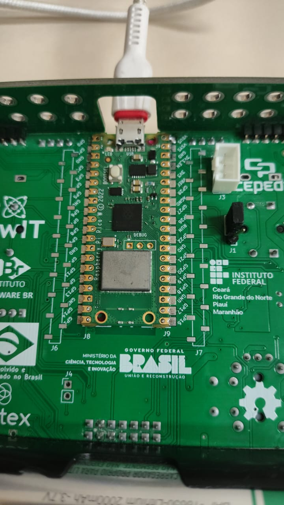
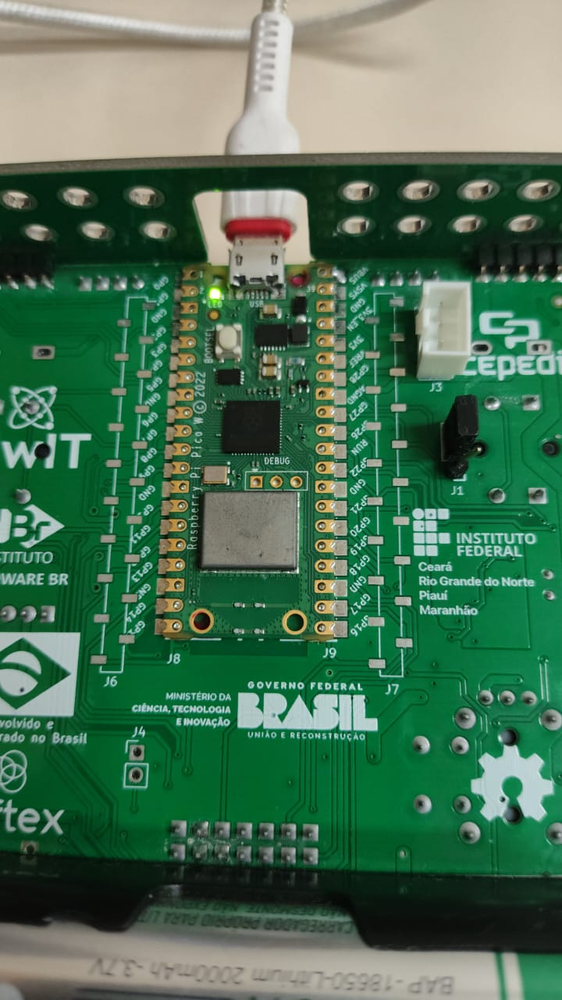

# Unidade 1 - Tarefa 4

---
## Objetivo do Projeto
*Reestruture esse código seguindo a arquitetura modular recomendada:*
- ***drivers/***: *código de controle direto de hardware (ex: LED embutido).*
- ***hal/***: *camada de abstração que expõe funções simples e reutilizáveis.*
- ***app/***: *lógica da aplicação principal (fluxo de controle, interface com usuário).*
- ***include/***: *cabeçalhos necessários.*
- ***CMakeLists.txt***: *organize a compilação conforme necessário.*

*Para esse fim, faça as seguintes tarefas:*
- *Crie um driver led_embutido.c que use diretamente a API cyw43_arch.*
- *Implemente um hal_led.c com a função hal_led_toggle() que abstraia o driver.*
- *Escreva um main.c simples no diretório app/ que apenas use a função da HAL para piscar o LED*
---

## Componentes Utilizados
Esta atividade utilizou só a BitDogLab, sendo principalmente um exercício em arquivos header e CMakeLists.

## Pinagem

| **Periférico** | **Pino** | **Funcionalidade** |
|----------------|----------|--------------------|
| --- | --- | --- |

## Implementação

Basicamente, a API led_embutido.h trabalha diretamente com o CYW43, enquanto o HAL trabalha só com a API led_embutido.h. Dessa forma, caso alguma mudança for feita nas implementações (os arquivos .c), ou caso uma nova API for implementada, não se torna necessário fazer uma reescrita voluminosa do código.

Para modularizar o código, os arquivos *.h foram implementados como interfaces, contendo só a informação correspondente a eles na sua definição. Nestes arquivos irão observar comentarios no formato Doxygen, para explicar o seu funcionamento.

## Resultados

