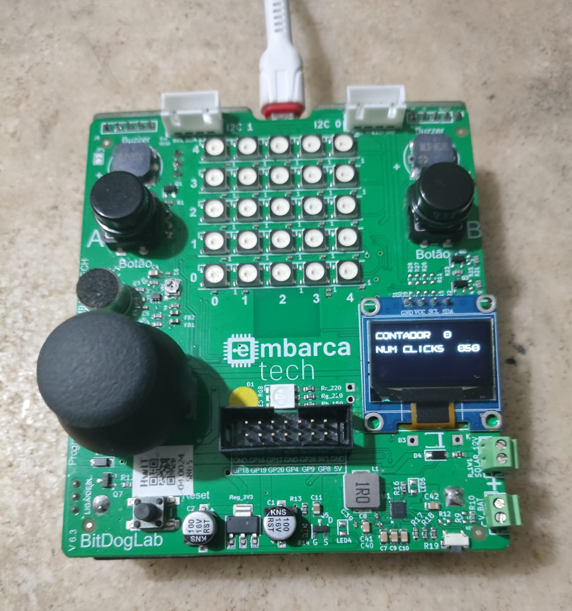

# Unidade 1 - Tarefa 1

---
## Objetivo do Projeto

*Faça um programa, em linguagem C, que implemente um contador decrescente controlado por interrupção, com o seguinte comportamento:*
- *Toda vez que o Botão A (GPIO5) for pressionado o contador decrescente reinicia em 9 e o valor da contagem é mostrado no display oled.*
- *O sistema entra em modo de contagem regressiva ativa, decrementando o contador de 1 em 1 a cada segundo até chegar em zero.*

*Durante essa contagem (ou seja, de 9 até 0), o programa deve registrar quantas vezes o Botão B (GPIO6) foi pressionado. O valor deste registro de eventos de botão pressionado também deve ser mostrado no display OLED.*

*Quando o contador atingir zero, o sistema congela e ignora temporariamente os cliques no Botão B (eles não devem ser acumulados fora do intervalo ativo).*

*O sistema permanece parado após a contagem, exibindo:*
- *O valor 0 no contador*
- *A quantidade final de cliques no Botão B registrados durante o período de 9 segundo (contagem regressiva)*

*Somente ao pressionar novamente o Botão A, o processo todo se reinicia:*
- *O contador volta para 9*
- *O número de cliques do Botão B é zerado*
- *A contagem recomeça do início*

***Requisitos de implementação:***
- *Utilize interrupções para detectar os cliques em ambos os botões (A e B).*
- *A lógica da contagem decrescente e atualização do display OLED deve ocorrer no loop principal.*
- *A variável que armazena os cliques do botão B deve ser zerada sempre que a contagem regressiva reiniciar.*
- *O OLED deve mostrar, em tempo real: O valor atual do contador (de 9 a 0) e a quantidade de cliques no Botão B dentro da contagem em andamento.*
---

## Componentes Utilizados
Esta atividade foi feita na sua inteiridade na *BitDogLab*, aproveitando os dois botões presentes na placa e o display OLED SSD1306.

## Pinagem

| **Periférico** | **Pino** | **Funcionalidade** |
|----------------|----------|--------------------|
| Botão A | GPIO 5 | INPUT mediante SRI. |
| Botão B | GPIO 6 | INPUT mediante SRI. |
| OLED SDA | GPIO14 | DATA do I2C. Escrita no OLED. |
| OLED SCL | GPIO15 | CLK do I2C. Escrita no OLED. |

## Implementação

Nesta atividade preciso configurar os dois botões (em GPIO5 e GPIO6) para realizarem duas tarefas distintas. O primeiro (o botão A) vai ativar uma contagem regressiva no meu código, enquanto o segundo (o botão B) capta o número de vezes que ele foi apertado durante esta contagem regressiva. Enquanto tudo isso acontece, fico atualizando no loop principal os valores que aparecem no display OLED 

Para cumprir coma a tarefa, o programa implementado funciona mediante uma máquina de estados simples, que troca entre os estados *ATIVA_CONTADOR*,*CONTANDO*, *DEBOUNCE_RISE*, *DEBOUNCE_FALL* e *STANDBY*. Estes estados servem como flags que vão definir quando certos trechos do código são executados.

> Os estados *DEBOUNCE_RISE* e *DEBOUNCE_FALL* fazem parte da lógica de debouncing do código. Esta lógica pode ser eliminada comentando fora do código a flag ATIVO_DEBOUNCE.

Assim, com a funcionalidade de debounce ativa, o código funciona da seguinte forma:

**(i)** O programa começa no estado *STANDBY*. Depois de apertar o botão A, entra no estado *ATIVA_CONTADOR*.

**(ii)** No estado *ATIVA_CONTADOR*, é accesado um trecho de código no loop principal que inicializa a captação de apertos de botão B, além de incializar a contagem regressiva de 9-0. Depois, entra-se no estado *CONTANDO*.

**(iii)** No estado *CONTANDO* é contabilizado o número de vezes que o botão B é apertado, mediante o debouncing de tanto a borda de subida (*DEBOUNCE_RISE*) como a borda de descida (*DEBOUNCE_FALL*) do botão. Depois de 1 segundo da inicialização deste estado, diminui-se o valor de contagem do display por 1. Este valor é diminuido a cada segundo até atingir 0, onde o programa volta ao estado *STANDBY*.

Enquanto o código está trocando entre seus estados de operação, no OLED estão sendo apresentados os valores das variáveis time_counter e num_clicks.

    CONTADOR   0
    NUM CLICKS 000

Esta atualização é realizada no loop principal.

## Detalhamento Técnico

Esta seção existe com o fim de documentar as escolhas feitas no código, visando facilitar sua compreensão.

### OLED / I2C

Para implementar a comunicação com o OLED foi utilizada a biblioteca ssd1306.h presente no repositório do [BitDogLabC](https://github.com/BitDogLab/BitDogLab-C/tree/main/display_oled). 

> Note-se que esta biblioteca possui seu próprio formato de fonte (em ssd1306_font) e suas próprias funções de escrita no OLED. Neste código, escolhi utilizar ssd1306_draw_char() para conseguir acrescentar variáveis no meu string final. 

A tarefa mais interessante realizada para o OLED foi a conversão de cada digito de um inteiro em um caractere capaz de ser interpretado pela biblioteca do SSD1306. Para este fim, aproveita-se o operador módulo (%) e uma consideração muito conveniente do C, que **toda** divisão entre inteiros e arredondada para abaixo. 

Com isso em mente, obteve-se o seguinte algoritmo:

> Seja nosso valor inteiro um uint8_t, igual a 251.
> Mediante o operador módulo obtenho o primeiro dígito deste número, e depois divido ele entre 10 para deixar só os outros dois digitos.
>
> 251 % 10 = 1
>
> 251 / 10 = 25,1 = 25
>
> Depois, com este novo valor, repito o processo. Obtenho o primeiro digito, e depois divido ele entre 10 para deixar so o outro digito.
>
> 25 % 10 = 5
>
> 25 / 10 = 2,5 = 2
>
> Com este processo, obtive de forma separada os três digitos que compõem o meu número decimal.

Estes digitos foram depois somados ao caractere '0'. O resultado desta operação, conforme visto na tabela [ASCII](https://www.asciitable.com/), corresponderia ao caractére associado ao número que foi somado.

> Exemplo: '0' + 3 = '3'
### Contagem Regressiva

A contagem regressiva foi implementada aproveitando a capacidade de obter *timestamps* presente no SDK do RP2040. A função utilizada foi:

    static inline absolute_time_t get_absolute_time(void)

Que devolve um valor do tipo **absolute_time_t** contendo informação do instante de tempo que a função foi chamada. Assim, dentro do código faz-se a comparação entre dois instantes de tempo dentro do loop principal:

1. O instante *countdown_time*, correspondente ao momento no tempo em que foi inicializada a contagem regressiva.
2. O instante *current_time*, correspondente ao instante, no tempo, em que o programa vai conferir se passou 1 segundo desde que a última contagem regressiva começou.

Estes dois valores são comparados mediante a função:

    static inline int64_t absolute_time_diff_us(absolute_time_t from, absolute_time_t to)

Que retorna a diferença em microsegundos entre os dois *timestamps*. Assim, dentro do loop principal, a cada certo tempo é comparado o valor em *countdown_time* com o instante de tempo atual, em *current_time*. Caso este valor ultrapasse 1 segundo, faz-se o descrescimo do contador *time_counter*, e se reinicia a variável *countdown_time*. Este processo continua até atingirmos o final da contagem regressiva.

> Esta implementação possui certo grau de imprecisão, por estar conferindo a cada certo intervalo indefinido de tempo se passou (ou não) um segundo. Caso for necessário ter exatidão, sugere-se a adoção de um **repeating timer**, que permitiria temporização bastante mais exata.

### Debouncing

Como o tratamento do botão B foi feito dentro de uma interrupção, resolver a questão de bouncing foi a parte mais problemática do código. Isso se deve ao fato que **os botões na placa sofrem bouncing tanto na borda de subida como na borda de descida**, o que no caso deste código, faz com que a interrupção configurada com *GPIO_IRQ_EDGE_FALL* ou *GPIO_IRQ_EDGE_RISE* seja acionada no instante que o usuario aperta ou solta o botão.

> Devido à montagem do hardware do BitDogLab os botões precisam ser configurados para funcionarem mediante um pull-up no GPIO. Dado que, ao apertar o botão, meu sinal deve ir de 3,3 V a 0 V. 

Para resolver esta questão, foi implementado uma lógica muito simples.

**(i)** No momento que o usuario aperta o botão B entramos na SRI mediante um *GPIO_IRQ_EDGE_FALL*. Dentro da SRI, obtemos um *timestamp* do instante em que entramos na interrupção (debounce_time), desativamos a interrupção, aumentamos o contador de vezes que o botão foi apertado e trocamos o estado do programa para *DEBOUNCE_FALL*.

Como a interrupção do botão B foi desativada, não há risco de realizarmos uma leitura errada devido ao bouncing, já que essa variação de sinal no GPIO não vai fazer nada.

**(ii)** No estado *DEBOUNCE_FALL* conferimos se passaram 20ms desde que trocamos de estado. Uma vez detectado que passaram 20ms, o estado troca para *CONTANDO* e configuramos uma nova interrupção no Botão B, uma interrupção ativada mediante um *GPIO_IRQ_EDGE_RISE*.

**(iii)** No momento em que o usuario solta o botão, entramos na SRI, obtendo um novo timestamp em debounce_time, desativando a interrupção e trocando de estado para *DEBOUNCE_RISE*. 

**(iv)** No estado *DEBOUNCE_RISE* se repete o processo descrito em (ii). Só que desta vez, uma vez passam os 20ms, se configura uma nova interrupção no Botão B, uma interrupção ativada mediante um *GPIO_IRQ_EDGE_FALL*. Repetindo o processo.

Note-se que a escrita na variável de contagem é realizada só na borda de descida, quando o botão é apertado.

> O debounce implementado desta forma não é perfeito, dado que decidi ignorar mudanças nos pinos só durante 20ms. Nos testes com a placa não apresentou muito problema, mas poderia se tornar problematico em outras placas. Caso for necessário, trocar o termo WAIT_DEBOUNCE.

## Resultados

