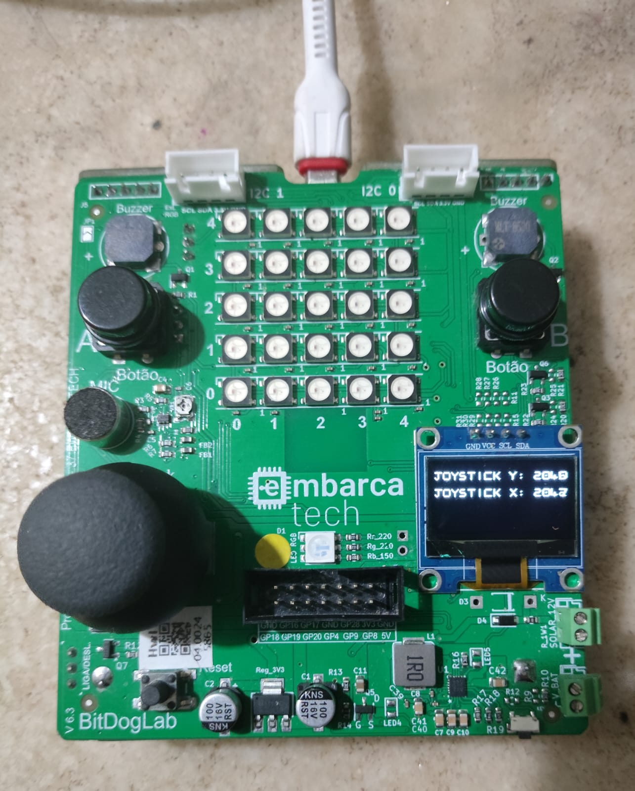
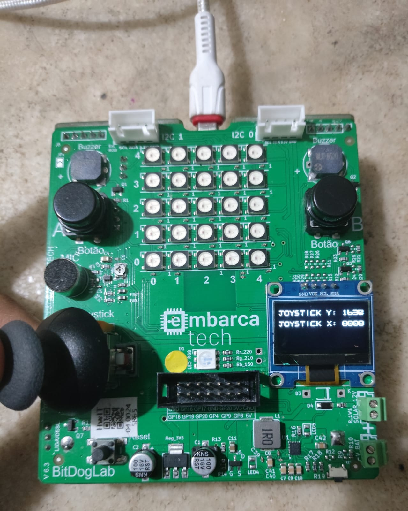
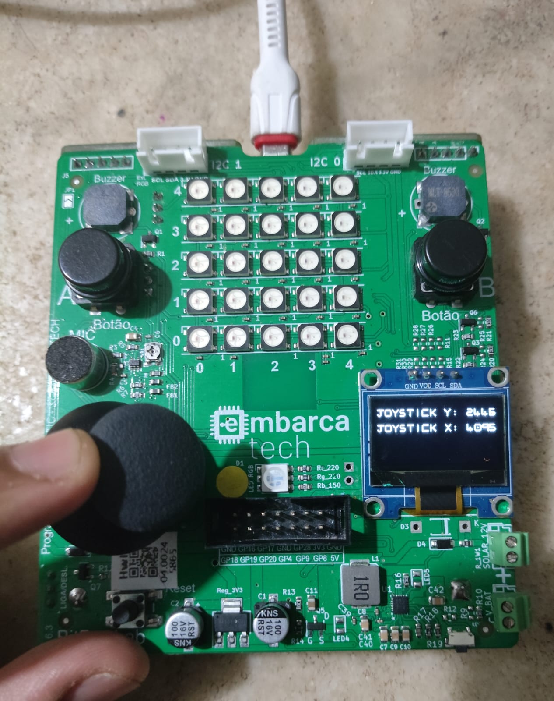

# Unidade 1 - Tarefa 2 

---
## Objetivo do Projeto

*Faça um programa em C para ler os valores convertidos digitalmente do joystick da BitDogLab. Os valores podem ser mostrados no terminal ou então no display OLED.*

---

## Componentes Utilizados
Esta atividade foi feita na sua inteiridade na *BitDogLab*, aproveitando o joystick de dois eixos e o display OLED SSD1306.

## Pinagem

| **Periférico** | **Pino** | **Funcionalidade** |
|----------------|----------|--------------------|
| Joystick (VRy) | GPIO 26 | INPUT ADC. Eixo Y do joystick. |
| Joystick (VRx) | GPIO 27 | INPUT ADC. Eixo X do joystick. |
| OLED SDA | GPIO14 | DATA do I2C. Escrita no OLED. |
| OLED SCL | GPIO15 | CLK do I2C. Escrita no OLED. |

## Implementação

Para esta tarefa preciso configurar o ADC do BitDogLab para amostrar os sinais de tensão presente nos pinos GPIO26 e GPIO27 (associados ao joystick) e apresentar eles no terminal ou no OLED. Note-se que existem múltiplas maneiras de realizar esta tarefa, ficando à mercê do programador a escolha.

Sendo assim, escolhi realizar esta tarefa no OLED, aproveitando dois recursos bastante legais do RP2040: o **modo *free-running* do ADC**, que realiza amostras de forma periodica dos canais configurados, e o **DMA**, que permite a transferência destes dados para à memória do RP2040. 

O intuito deste código é realizar a leitura dos dados do ADC totalmente fora do loop principal, deixando então um núcleo do RP2040 bastante livre para realizar qualquer outra tarefa. Na configuração usada, produzem-se 500k amostras por segundo no ADC. Cada amostra é processada no código depois dela ser finalizada.

O programa funciona da forma seguinte:

**(i)** A cada determinado tempo (t = 2us) o ADC realiza a leitura dos dados nos seus canais 0 e 1, associados aos pinos VRX e VRY do joystick.

**(ii)** Uma vez a amostra é coletada, o ADC encaminha uma requisição ao DMA, que recolhe este valor de 12 bits (dentro da FIFO do ADC) e encaminha ele à variável joystick_samples (na SRAM).

**(iii)** Os valores armazenados na variável joystick_samples são apresentados no display OLED, depois de aplicar uma ligeira correção neles.

Deu para perceber que joystick possui um certo *drift*, onde o valor captado no eixo-x e eixo-y aumenta com o tempo. Além disso, é possível ver que a movimentação do joystick para os lados muda o valor que ele tem no centro, em repouso. Para mitigar estes erros é necessário realizar uma correção de dados mais robusta, como a adoção de um *filtro de Kalman* no código.

## Detalhamento Técnico

Esta seção existe para finalidades de documentação, visando facilitar a compreensão do código.

Neste programa foram configurados três elementos de hardware, o I2C, o ADC e o DMA. O I2C foi explicado previamente, no código Contador_OLED, pelo qual focarei minha atenção no ADC e no DMA.

### ADC
Existem três funções "novas" que foram aproveitadas neste código, sendo elas:

     static void adc_set_round_robin (uint input_mask) [inline], [static]

Esta função permite configurar o ADC no modo de *round robin*. Basicamente, em vez de precisar selecionar manualmente qual canal o ADC vai estar lendo mediante a função adc_select_input(), configuro o periférico para realizar a seleção sequencial dos canais especificados na entrada *input_mask*. Esta troca de canal é feita depois da finalização da amostragem prévia.

Ao escrever adc_set_round_robin((1<<ADC_CHANNEL_1) | (1<<ADC_CHANNEL_2))
configuro a seguinte sequência de seleções de canal:
Canal 1 -> Canal 2 -> Canal 1 -> Canal 2 -> ...

     static void adc_fifo_setup (bool en, bool dreq_en, uint16_t dreq_thresh, bool err_in_fifo, bool byte_shift) [inline], [static]

Esta função permite habilitar e configurar a FIFO do ADC. Neste exemplo, o ADC é configurado para encaminhar os seus dados na sua FIFO (dreq_en = true) para que, depois de realizar uma amostra (dreq_tresh = 1), os dados sejam pegues pelo DMA e encaminhados para a memória interna do RP2040. 

A entrada err_in_fifo não é habilitada pelo fato de não termos necessidade de um bit de erro nesta aplicação, e o byte_shift fica desabilitado pelo fato que estou encaminhando os meus dados a um bloco de memória configurado para receber valores de 16 bits. Caso forem encaminhados para um outro FIFO (de 8 bits) este valor precisaria ser true.

     static void adc_run (bool run) [inline], [static]

Esta função permite a configuração do ADC no modo *free_running*, onde este periférico realiza a amostragem de um outro valor no instante que a amostragem prévia é finalizada.

### DMA

O DMA foi configurado para receber uma requisição do ADC, encaminhar os dados da FIFO do ADC para a variável de armazenamento, e entrar numa subrotina de interrupção (SRI) depois de ter realizado dois accesos de memória. Como o DMA é desabilitado automaticamente depois de realizar estes dois accesos, dentro da SRI o DMA é habilitado de novo, para realizar dois novos accesos de memória e voltar a ser habilitado. Nesta configuração, o DMA funciona para sempre.

Para permitir seu funcionamento nesta configuração, foram realizadas as seguintes configurações:

    channel_config_set_transfer_data_size(&dma_cfg, DMA_SIZE_16);

    channel_config_set_read_increment(&dma_cfg, false);

    channel_config_set_write_increment(&dma_cfg, true);

    channel_config_set_ring(&dma_cfg, true, 2);

Note-se que nesta configuração o DMA encaminha dados de 16 bits lidos de um endereço que não vai mudar depois de cada leitura a outro endereço que, a diferença do primeiro, vai mudar. Depois de realizar duas escritas de 16 bits, a DMA não está mais apontando para o vetor de 2 elementos de 16 bits, joystick_samples. Para corrigir este comportamento, e garantir que o DMA vai apontar de novo para o começo desta matriz depois de realizar a escrita dos dois valores, utilizo o comando channel_config_set_ring.

Mediante ele, falo para minha DMA que o endereço de escrita (leitura = false, escrita = true) vai precisar "voltar" 2^n bytes na memória depois de acabar o processo de transferência de dados. (Neste exemplo em específico, como n=2, voltamos 2^2 = 4 bytes na memória). Dessa forma, depois realizar as minhas duas transferências de 2 bytes, "volto" ao meu endereço inicial. No entanto, se os dados não estiverem *alinhados* na memória em um bloco múltiplo de 4 bytes, o buffer não vai funcionar.

    uint16_t joystick_samples[2] __attribute__((aligned(4))); 

Ao que se refere alinhamento? Se um endereço está alinhado com 4, isso implica que o valor dele é divisivel entre 4 sem nenhum valor remanescente. (Ou seja, se um endereço está alinhado com 4, 0xXXXXXXXX % 4 = 0. Caso contrário, não está alinhado).

#### Importância do alinhamento
Por que é importante esta configuração? Devido aos principios de funcionamento do DMA. Antes de começar, precisa-se entender que **o DMA não se interessa por conhecer o endereço inicial ou final de uma operação de escrita**, ele só se interessa por conhecer um endereço base e um *offset* que ele vai aplicar nele para ir ao próximo endereço. 
> Consideremos 0x2000 com um offset de 32 bits. Neste caso, o DMA vai progredir na seguinte sequência: 0x2000 -> 0x2004 -> 0x2008 -> ...

Neste código, por ter definido uma variável uint16_t, vou precisar de 2 bytes de memória para armazenar cada elemento da minha matriz. O meu compilador, considerando o *alinhamento natural* da minha variável, vai armazenar ela alinhada com 2 na memória. Ou seja, meu dado vai ser jogado num endereço divisível entre 2.

> Para um alinhamento com 2, os possiveis endereços seriam 0x80000000, 0x80000002 e 0x80000004.
>
> Para um alinhamento com 4, estes possíveis endereços seriam 0x80000000 e 0x80000004.

A forma que o DMA implementa o ring buffer é olhando os **n** últimos bits do endereço base, e zerando-os depois que acaba meu procedimento de transferência. Se consideramos n=2, o meu DMA vai olhar só os últimos 2 bits no endereço de memória e ZERAR eles depois de realizar as transferências desejadas.

> **Exemplo:** Seja 0x80000002 o endereço base. Como o DMA vai fazer duas transferências de dois bytes, ele vai olhar os seguintes endereços:
>
> 0x80000002 = 0b1000 0000 ... 0000 0000 0000 0010
>
> 0x80000004 = 0b1000 0000 ... 0000 0000 0000 0100
>
> Depois da segunda transferência, o DMA vai zerar os dois últimos bits do endereço, que gera o problema. Depois da primeira execução do DMA, fica como endereço base o endereço errado (0x80000004). Na próxima execução, o DMA vai escrever em endereços desvinculados ao original, corrompendo informação do RP2040.

Caso a variável for armazenada na memória com o *alinhamento de 4 bytes*, obteria-se o seguinte exemplo:

> **Exemplo:** Seja 0x80000000 o endereço base. Realizando duas transferências, obtem-se os seguintes endereços:
>
> 0x80000000 = 0b1000 0000 ... 0000 0000 0000 0000
>
> 0x80000002 = 0b1000 0000 ... 0000 0000 0000 0010
>
> Depois da segunda transferência, o DMA zera os dois últimos bits do endereço. Dessa forma, depois da primeira execução do DMA, fica como endereço base o endereço correto (0x80000000). Na próxima execução, o DMA vai escrever o valor no endereço certo, repetindo o processo descrito anteriormente.

Devido ao alinhamento correto da variável na memória, não houve risco de corromper outros dados na memória, e o buffer em anel vai funcionar corretamente.

## Resultados

