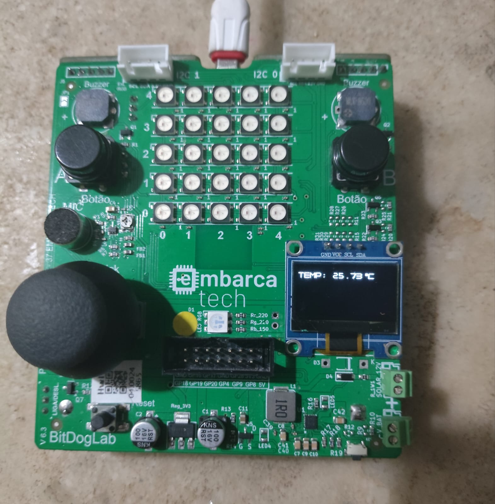

# Unidade 1 - Tarefa 3

---
## Objetivo do Projeto

*Faça um programa em C para ler a temperatura interna do RP2040. Converta a leitura do ADC em um valor em ºC.*

---

## Componentes Utilizados
Esta atividade foi feita na sua inteiridade na *BitDogLab*, usando o sensor de temperatura embutido no RP2040 e o display OLED SSD1306.

## Pinagem

| **Periférico** | **Pino** | **Funcionalidade** |
|----------------|----------|--------------------|
| OLED SDA | GPIO14 | DATA do I2C. Escrita no OLED. |
| OLED SCL | GPIO15 | CLK do I2C. Escrita no OLED. |

> O sensor de temperatura interno é accesado mediante uma configuração específica do DMA. Ele não possui uma pinagem associada.

## Implementação
Para esta tarefa preciso configurar o ADC do RP2040 para realizar a leitura do sensor de temperatura interno (provavelmente, no silicio do microcontrolador) que ele possui. O programa é muito simples, e funciona da seguinte forma:

**(i)** A cada 200ms o programa faz uma leitura do ADC. O programa transforma este valor de 12 bits para um valor de tensão, que depois é transformado em um valor de temperatura. Este valor de temperatura é finalmente apresentado no display OLED.

## Detalhamento Técnico

Esta seção existe para finalidades de documentação, visando facilitar a compreensão do código.

### ADC
A configuração do ADC para a leitura do sensor foi muito simples, ficando claro no código. O aspecto mais interessante foram as fórmulas usadas para ir de um número de 12 bits representando tensão, até um float represetando temperatura.

    const float ADC_RESOLUTION = 3.3f / (1 << 12);

    float ADC_voltage = ADC_RESOLUTION * (float)adc_read();

    float temperature = 27.0f - (ADC_voltage - 0.706f)/0.001721f;

O primeiro valor, correspondente à resolução do ADC, foi retirado da seção do hardware_adc presente na documentação do Pico SDK. Com este primeiro valor é possível transformar a leitura do adc (em uint16_t) para um float correspondente à tensão no pino associado.

A temperatura foi obtida mediante a fórmula apresentada no manual do RP2040, na página 563.

> Os valores de temperatura lidos do sensor interno variam bastante. No manual é dito que estes valores são extremamente sensíveis à temperatura de referência, além de variarem de dispositivo a dispositivo. 
>
> Para obter um melhor resultado, seria necessário realizar um estudo mais aprofundado do sensor de temperatura do RP2040, para calibrar ele corretamente, além de definir uma referência de tensão garantidamente continua.

### OLED

O OLED foi implementado igual que nos outros projetos. No entanto, para conseguir representar os caracteres '.', ':' e '°' a biblioteca foi ligeiramente modificada.

Na função **ssd1306_get_font** foi feito o seguinte acrescimo:

    else if (character == '.'){
    return character - '.' + 37;
    }
    else if (character == ':'){
        return character - ':' + 38;
    }
    else if (character == ';'){
        return character - ';' + 39;
    } 

No instante que passo um caractere à biblioteca, mediante **ssd1306_draw_char**, o OLED vai conferir se o caractere corresponde a estes novos elementos. Caso ele corresponder, o RP2040 vai accesar a matriz font[] (definida dentro do arquivo *ssd1306_font.h*), e realizar a escrita destes novos elementos presentes nas posições 37, 38 e 39. Note-se que como o símbolo '°' não existe em ASCII, ele foi associado ao caractere ';'.

Assim, foram implementados os seguintes bitmaps em *ssd1306_font.h*:

> 0x00, 0x00, 0x00, 0x40, 0x00, 0x00, 0x00, 0x00; representando '.'
>
> 0x00, 0x00, 0x00, 0x24, 0x00, 0x00, 0x00, 0x00; representando ':'
>
> 0x00, 0x00, 0x00, 0x00, 0x07, 0x05, 0x07, 0x00; representando '°'

## Resultados
