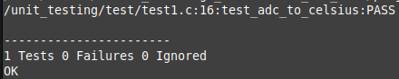

# Unidade 1 - Tarefa 5

---
## Objetivo do Projeto

*Implemente a função float adc_to_celsius(uint16_t adc_val);*
*Escreva uma função de teste unitário que verifica se a função retorna o valor correto (com margem de erro) para uma leitura simulada de ADC. Sugere-se o uso da biblioteca Unity para o teste unitário.*
*Use um teste com valor de ADC conhecido (ex.: para 0.706 V, a temperatura deve ser 27 °C).*

---

## Componentes Utilizados
Esta atividade, sendo principalmente de programação, não envolve a utilização do BitDogLab.

## Pinagem

| **Periférico** | **Pino** | **Funcionalidade** |
|----------------|----------|--------------------|
| --- | --- | --- |

## Implementação

Para realizar testes unitarios foi necessária a inclusão de um novo arquivo, nomeado *external* ,contendo o código fonte da biblioteca *Unity*, que foi aproveitado para realizar o teste da função adc_to_celsius.

A lógica correspondente ao teste unitário se encontra no diretorio */test*, e em *test_inc* se encontra o arquivo header definindo a função para ser testada. O código de teste em *test1.c* é:

    #include <unity.h>
    #include "test_inc/adc_test.h"

    void test_adc_to_celsius(void){
        // Note-se que o último argumento é trabalhado como int.
        TEST_ASSERT_FLOAT_WITHIN(0.5f, 27.0f , adc_to_celsius(876)); 
    }

    void setUp(){};
    void tearDown(){};

    int main(void){
        UNITY_BEGIN();

        RUN_TEST(test_adc_to_celsius);

        return UNITY_END();
    }

Com a seguinte definição para adc_to_celsius (presente em adc_test.c):

    #include "adc_test.h"

    float adc_to_celsius(uint16_t adc_val){
        float ADC_RESOLUTION = 3.3f / (1 << 12);
        return (27.0f - (ADC_RESOLUTION * (float)adc_val - 0.706f)/0.001721f);
    }

Este teste confere, mediante a função **TEST_ASSERT_FLOAT_WITHIN** se o float gerado pela função adc_to_celsius, com entrada *adc_val = 876* está no intervalo [26,5 ; 27,5], conforme esperado ao resolvermos a equação com 876. Se a implementação estiver errada, o teste iria falhar, mostrando que há algum problema na lógica desenvolvida.

> As funções setUp() e tearDown() foram declaradas no código como exigência do Unity quando ele é instalado diretamente, como foi feito aqui.

## Instruções

> Antes de começar, precisa-se limpar o diretorio /build do projeto.

Para rodar o teste unitário é necessário abrir o CMakeLists e conferir se TEST_BUILD = 0, conforme apresentado na seguinte linha de código:

    option(TEST_BUILD "OFF: Compila o .exe para o RP2040. ON: Compila no meu PC o .exe de teste unitario." ON)

Caso o flag TEST_BUILD estiver OFF, basta apagar o valor e escrever ON.

Uma vez configurado, o CMakeLists pode ser executado mediante a linha de comando, ou mediante extensões do VSCode. Este CMake vai gerar um arquivo executável nomeado **test1_app**, correspondente ao teste unitário, dentro do diretorio build. Para realizar o teste unitario precisa-se executar *test1_app*.

> Nesta implementação em específico, o CMakeLists foi executado mediante a extensão do Pico SDK, aproveitando as ferramentas de CMake que ela oferece.

## Resultados

