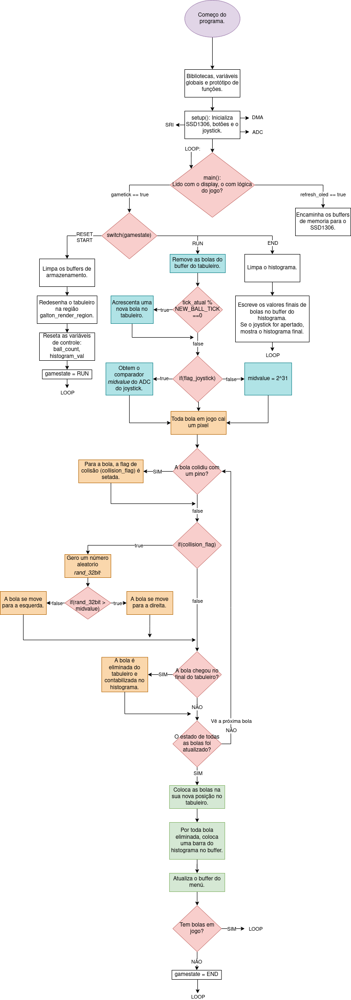
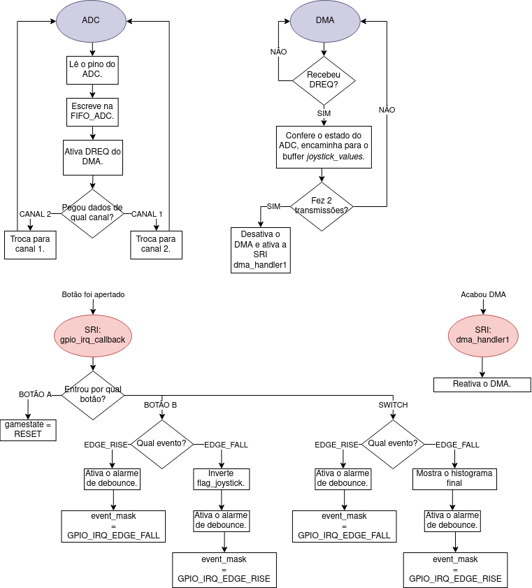
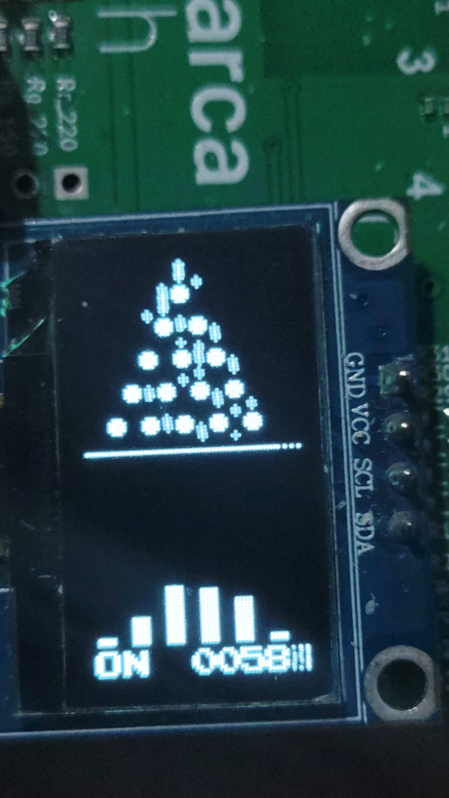
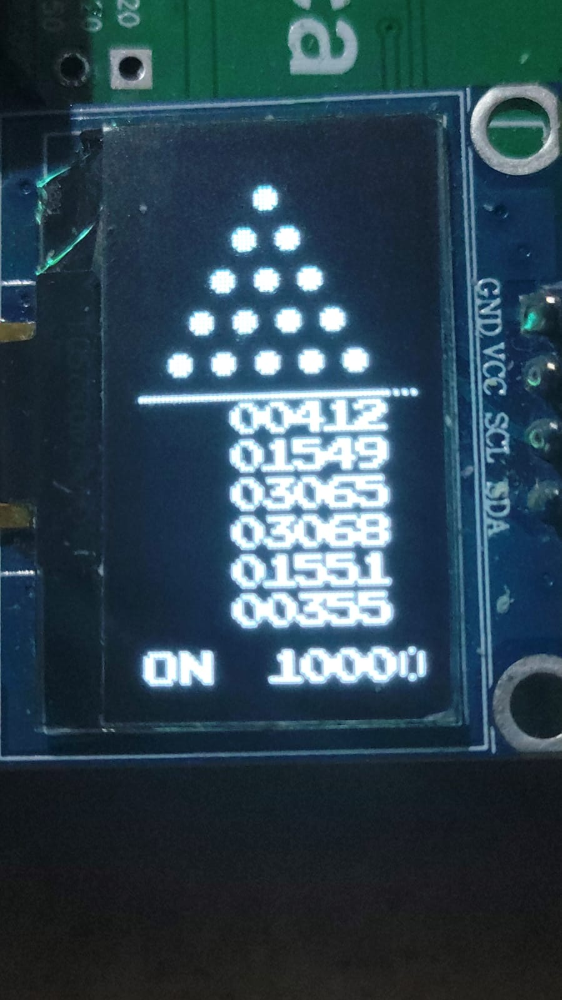

# Fase 2 - Projeto 1 : Galton Board

O projeto do **Galton Board** consiste na simulação do "Tabuleiro de Galton" no OLED da placa BitDogLab. 

---
## Objetivo do Projeto

*Fazer uma simulação do tabuleiro de galton na BitDogLab que seja capaz de:*
- *Mostrar múltiplas bolas caindo simultaneamente.*
- *Mostrar um histograma atualizado em tempo real no OLED.*
- *Mostrar um contador de bolas visível no display.*
- *Analisar a distribuição dos resultados (bolas por canaleta).*
- *Desbalancear o display, introduzindo um "bias" nos pinos.*
---

## Componentes Utilizados
Os componentes neste projeto estão contidos na sua inteiridade no BitDogLab, sendo eles o OLED, os botões A e B e o joystick.

## Pinagem

| **Periférico** | **Pino** | **Funcionalidade** |
|----------------|----------|--------------------|
| Botão A | GPIO 5 | INPUT mediante SRI. |
| Botão B | GPIO 6 | INPUT mediante SRI. |
| Joystick (Switch) | GPIO 22 | INPUT mediante SRI. Botão do Joystick |
| Joystick (VRy) | GPIO 26 | INPUT ADC. Eixo Y do joystick. |
| Joystick (VRx) | GPIO 27 | INPUT ADC. Eixo X do joystick. |
| OLED SDA | GPIO14 | DATA do I2C. Escrita no OLED. |
| OLED SCL | GPIO15 | CLK do I2C. Escrita no OLED. |

## Implementação

O tabuleiro de Galton foi desenvolvido considerando 15 pinos de tamanho 5x5, distribuidos ao longo da região delimitada por galton_render_region, e uma bolinha 3x3.

Cada bolinha cai 1 pixel a cada tick. Uma vez o programa percebe que a *hitbox* da bolinha entrou em contato com a *hitbox* de um pino, a bolinha se movimenta aleatoriamente à direita ou à esquerda. Uma vez a bolinha chega no final da região do tabuleiro, ela é contabilizada num vetor e eliminada do display. Na tela embaixo do tabuleiro, pode ser visualizada uma contagem do número de bolinhas caindo em cada canaleta.

O botão A serve para *resetar* o jogo, começando sua execução do 0, enquanto o botão B serve para ativar e desativar o joystick. O Joystick, ao ser movimentado, aplica um viés na movimentação das bolinhas, fazendo com que as chances delas irem para a esquerda ou direta não seja mais 50/50.

Finalmente, quando acaba a execução do programa, é exibida a contagem total das bolinhas na região do histograma, que, ao apertar o joystick, mostra o histograma final de contagem (ou volta à configuração inicial).

O funcionamento do código é apresentado com maior detalhe no fluxograma a seguir. Observe-se que ele foi implementado com um **loop infinito**:

> O código em app/galton_board.c está comentado. Sua leitura deveria ajudar na compreensão de como alguns blocos foram implementados.

Depois da execução do *setup()*, tem-se algumas rotinas sendo executadas no plano de fundo ou sendo executadas como parte de um evento inesperado (SRI):

O ADC e o DMA estão em funcionamento continuo, enquanto a SRI dos botões somente é ativada quando algum deles for apertado.

## Detalhamento Técnico

Esta seção existe com o fim de documentar as escolhas feitas no código, visando facilitar sua compreensão.

### Galton Board

#### Números aleatórios

Para a geração de números aleatórios foi utilizada a biblioteca "pico/rand.h" fornecida pelo Pico SDK. Esta biblioteca é customizável, deixando o usuario livre para escolher qual vai ser a fonte de "entropia" usada para modificar o estado do PRNG que utilizam.

A configuração final é:

    PICO_RAND_ENTROPY_SRC_ROSC = 1
    PICO_RAND_ENTROPY_SRC_TIME = 0
    PICO_RAND_ENTROPY_SRC_BUS_PERF_COUNTER = 0
    PICO_RAND_SEED_ENTROPY_SRC_ROSC = 1
    PICO_RAND_SEED_ENTROPY_SRC_TIME = 0
    PICO_RAND_SEED_ENTROPY_SRC_BOARD_ID = 1
    PICO_RAND_SEED_ENTROPY_SRC_RAM_HASH = 1

Esta configuração usa o oscilador em anél interno do RP2040 como a única fonte de entropia. Ela foi escolhida pelo fato dela ter se mostrado a melhor para geração de números aleatórios, conforme testado por usuarios do RP2040 no [forum](https://forums.raspberrypi.com/viewtopic.php?t=347305). Note-se que o ROSC parece estar desativado por padrão no instante de executar o RP2040. No entanto, a biblioteca já o configura e ativa, sempre que o RP2040 não estiver usando ele como oscillador principal.

Com esta ferramenta, fez-se a lógica de seleção de caminho. Caso o joystick estiver *desativado*, e o número de 32 bits gerado por **get_rand_32** for maior a 2^31, a bola se movimenta para a direita (caso contrario, à esquerda). Se o joystick estiver *ativado*, caso o número de 32 bits obtido for maior que o número obtido do ADC do joystick, a bola se movimenta para a direita, também (caso contrario, à esquerda).

### OLED

> Sugere-se fortemente ver ssd1306_rp2040_i2c.h, ssd1306_program_sprites.h e ler o seu correspondente arquivo .c. A implementação fica mais clara visualizando estes arquivos.

Nesta implementação, o **OLED foi inicializado com endereçamento vertical**, pelo qual as estruturas de dados e as imagens foram projetadas para este tipo de endereçamento. Não se garante que a implementação funcione, sem ajustes, para um endereçamento horizontal.

> Neste tipo de endereçamento, os dados encaminhados para o display preenchem sua RAM interna coluna por coluna, começando do bit menos significativo da página 1 e terminando com o bit mais significativo da página 8. Depois de encaminhar 8 bytes, se progrede à próxima coluna.

A biblioteca usada para configurar e escrever os dados no OLED é uma versão modificada da biblioteca disponibilizada no repositorio BitDogLabC. Esta versão conta com as seguintes funções novas:

    extern void ssd1306_draw_sprite(render_region_t *region, sprite_t *sprite, bool horizontal_addressing);

    extern void ssd1306_remove_sprite(render_region_t *region, sprite_t *sprite, bool horizontal_addressing);

    extern void render_on_display(render_region_t *region);

    extern void remove_on_display(render_region_t *region);

    extern void ssd1306_blink(bool on);

Que utilizam duas novas estruturas introduzidas neste código, *render_region_t* e *sprite_t*. Estas duas estruturas são implementadas na biblioteca *ssd1306_program_sprites* e definem dois conceitos aproveitados neste código, **regiões** e **sprites**:

    typedef struct{
        uint8_t start_column;
        uint8_t end_column;
        uint8_t start_page;
        uint8_t end_page;
        uint8_t width;
        uint8_t height;
        uint8_t *bitmap;
        uint buffer_length;
    } render_region_t;

    typedef struct{
        uint8_t x_pos;
        uint8_t y_pos;
        uint8_t width;
        uint8_t height;
        uint8_t *bitmap;
    } sprite_t;

Cada região corresponde a um segmento do SSD1306 distinto, que conta com um bitmap correspondente dentro da memória do RP2040. As três regiões projetadas neste código são o **tabuleiro**, o **histograma** e o **menu**. Cada região conta com sua própria origem, e os *sprites* são colocados dentro de cada região considerando a origem da região onde eles forem colocados. Como exemplo de região, tem-se o seguinte trecho de código:

    static uint8_t menu_bitmap[] = {
        0x00, 0x00, 0x00, 0x00, 0x00, 0x00, 0x00, 0x00, // MENU START
        0x00, 0x00, 0x00, 0x00, 0x00, 0x00, 0x00, 0x00,
        0x00, 0x00, 0x00, 0x00, 0x00, 0x00, 0x00, 0x00,
        0x00, 0x00, 0x00, 0x00, 0x00, 0x00, 0x00, 0x00,
        0x00, 0x00, 0x00, 0x00, 0x00, 0x00, 0x00, 0x00,
        0x00, 0x00, 0x00, 0x00, 0x00, 0x00, 0x00, 0x00,
        0x00, 0x00, 0x00, 0x00, 0x00, 0x00, 0x00, 0x00,
        0x00, 0x00, 0x00, 0x00, 0x00, 0x00, 0x00, 0x00,
        0x00, 0x00, 0x00, 0x00, 0x00, 0x00, 0x00, 0x00,
        0x00, 0x00, 0x00, 0x00, 0x00, 0x00, 0x00, 0x00
    };  // Pos X: 118 -> 128: 10 itens

Que corresponde ao menu renderizado nas últimas 10 colunas do display.

Por sua vez, os sprites correspondem a bitmaps pequenos que contem figuras variadas que podem ser renderizadas dentro de cada região. Neste projeto, os sprites são uma esfera 5x5, uma estrela 3x3, e diversos números e letras na fonte usada em Mario Bros do Nintendo Entertainment System (NES). A origem de cada sprite se encontra no seu canto superior direito, conforme apresentado em seguida:

    static uint8_t pin_bitmap[] = {
        0b0000111X, 
        0b00011111,
        0b00011111,
        0b00011111,
        0b00001110
    };

    A região marcada como X corresponde à origem do sprite dos pinos.

Mediante os parâmetros *x_pos* e *y_pos* a localização da origem deste sprite pode ser controlado, e mediante os parâmetros *width* e *height* sua região de contato é conhecida. Além disso, estes últimos parâmetros permitem que só a seção desejada pelo usuario seja desenhada no display.

Estas duas estruturas facilitam a modificação dos dados armazenados em cada *bitmap* das regiões. Este bitmap é o parâmetro mais importante, já que serve como uma interface direta entre o RP2040 e o SSD1306. Mediante a função ssd1306_draw_sprite qualquer sprite desenhado pelo usuario pode ser inserido no bitmap da região que ele quiser. Uma vez no bitmap, mediante a função render_on_display, os dados a serem renderizados podem ser encaminhados ao SSD1306. 

> Esta abordagem foi adotada pelo fato que permite mais flexibilidade no projeto do display, permitindo desenhar quaisquer sprites o usuario deseje na tela. Além disso, pensar em cada segmento do OLED como sendo uma região distinta, facilitou bastante o cálculo das posições nas quais os *sprites* seriam colocados neles.

## Compilação

Para compilar este código, basta executar seu CMakeLists. 

## Possiveis Melhorias

Existem varias melhorias que poderiam ser feitas:
- O desenvolvimento de uma camada HAL para generalizar mais o código, de forma que ele possa ser executado com mínimos ajustes nas versões mais novas da BitDogLab, que usam um OLED maior de 128x128.
- Maior modulação do código, tendo dessa forma múltiplos .h, cada um encarregado com uma tarefa distinta. (Ex. renderer.h, engine.h, galton_logic.h).
- A implementação de uma *engine* física que esteja rodando de fundo, de forma que a simulação do tabuleiro passe a ser uma simulação física, considerando colisões elasticas ou inelasticas conforme for preciso.
- A criação de uma estrutura de dado (junto com sua respectiva função de limpeza) que permita iterar únicamente sobre aquelas bolinhas que estão na tela. Da forma que o código foi implementando, atualmente, o código itera e executa operações sobre TODA bolinha que já apareceu na tela.

## Resultados

